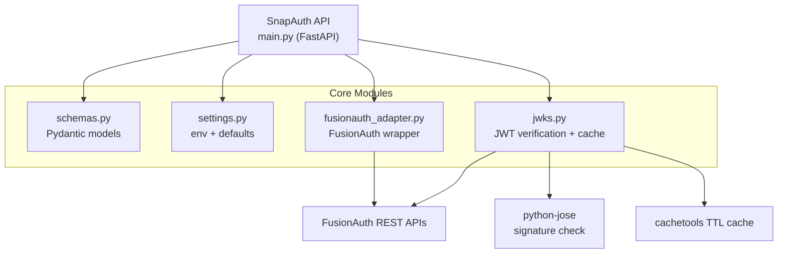

  

SnapAuth is a composed, resilient wrapper around identity providers. It speaks one voice to your services, contains the complexity inside, and scales without begging upstream auth for every verification. The surface stays small, the guarantees stay strong.

### Highlights

- One façade for diverse authentication backends (launching with FusionAuth)
- Token verification happens locally, minimizing latency and dependency blast radius
- Auto-generated API documentation keeps teams aligned and onboarding fast
- CI/CD pipeline publishes hardened containers, ready for any runtime footprint
- Deployment stack lives separately, so consumers pull a clean package without source noise

### 

