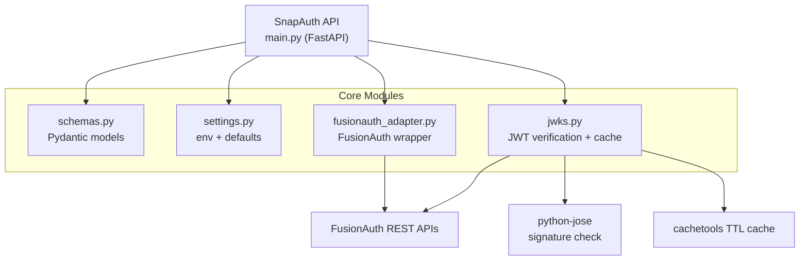

# SnapAuth



> A minimal authentication layer for FusionAuth that ships with batteries-included defaults

## Overview

SnapAuth delivers a ready-to-run authentication backend on top of FusionAuth. It exposes a tiny HTTP surface, handles bootstrap, and lets downstream services verify JWTs locally without touching FusionAuth’s admin UI.

## Features

- **Stateless Authentication** — JWT tokens with embedded roles
- **Local Authorization** — No centralized authorization calls
- **Token Management** — Access and refresh token lifecycle
- **JWKS Proxy** — Public key distribution for token verification
- **Role-Based Access** — User and admin roles with extensibility
- **Production Ready** — Docker containerization with health checks

## Architecture


- `main.py`: FastAPI entrypoint wiring routes and dependency flow.
- `schemas.py`: Pydantic request/response models validating payloads.
- `settings.py`: Loads environment-driven configuration defaults.
- `fusionauth_adapter.py`: Thin client over FusionAuth REST SDK.
- `jwks.py`: Manages OIDC metadata, JWKS cache, and token verification.
- `FusionAuth REST APIs`: External identity provider endpoints.
- `python-jose`: Performs JWT signature and claim validation.
- `cachetools TTL cache`: Caches JWKS and OIDC configs for fast reuse.

## Quick Start

### Full Stack (with bundled FusionAuth + Postgres)

```bash
docker compose up --build  # bootstrap runs automatically to generate secrets
```

After the services are running, verify with:

```bash
# Verify health
curl http://localhost:8080/health

# Create user
curl -X POST http://localhost:8080/v1/users \
  -H "Content-Type: application/json" \
  -d '{"username": "john", "password": "secure123", "roles": ["user"]}'

# Authenticate
curl -X POST http://localhost:8080/v1/auth/login \
  -H "Content-Type: application/json" \
  -d '{"username": "john", "password": "secure123"}'
```

**Optional: Manual Bootstrap**

If you need to regenerate secrets (for example, after modifying `.env`), you can run bootstrap manually:

```bash
python scripts/bootstrap.py  # regenerates .env and kickstart.json
```

### SnapAuth Only (reuse existing FusionAuth)

Use the published image and point it at your FusionAuth deployment. No extra database containers are started.

```bash
docker run -d --name snapauth -p 8080:8080 \
  -e FUSIONAUTH_BASE_URL="https://auth.example.com" \
  -e FUSIONAUTH_APPLICATION_ID="<APP_ID>" \
  -e FUSIONAUTH_CLIENT_SECRET="<CLIENT_SECRET>" \
  -e FUSIONAUTH_API_KEY="<API_KEY>" \
  -e JWT_EXPECTED_ISS="https://auth.example.com" \
  -e JWT_EXPECTED_AUD="<APP_ID>" \
  ghcr.io/parhamdavari/snapauth:latest
```

```bash
# Health and JWKS sanity
curl http://localhost:8080/health
curl http://localhost:8080/health/jwt-config
```

- `FUSIONAUTH_BASE_URL` must be the exact FusionAuth issuer URL, reachable from the container.
- `FUSIONAUTH_API_KEY` is required only for user management endpoints; omit it if you only call `/v1/auth/*`.
- `FUSIONAUTH_CLIENT_SECRET` is required when using `/v1/auth/refresh`.
- `JWT_EXPECTED_AUD` should match your FusionAuth Application ID if tokens include an audience claim.

## API Reference

### Authentication

| Endpoint | Method | Purpose |
|----------|--------|---------|
| `/v1/auth/login` | POST | Authenticate user |
| `/v1/auth/refresh` | POST | Refresh access token |
| `/v1/auth/logout` | POST | Revoke tokens |
| `/v1/auth/me` | GET | Get user info |

### User Management

| Endpoint | Method | Purpose |
|----------|--------|---------|
| `/v1/users` | POST | Create user with roles |

### Token Verification

| Endpoint | Method | Purpose |
|----------|--------|---------|
| `/v1/.well-known/jwks.json` | GET | Public keys for JWT verification |

## Configuration

The `.env` file ships with placeholder values (set to `CHANGE_ME`). On first `docker compose up`, a bootstrap service automatically:

- generates unique IDs and secrets for FusionAuth (API key, client secret, application ID, admin password)
- synchronises those values into `.env`
- generates `kickstart/kickstart.json` so FusionAuth provisions itself on startup
- sets database credentials that the bundled Postgres container and FusionAuth share

The bootstrap process is **idempotent** — it only generates values for keys set to placeholders, preserving any manually configured values.

**To customize configuration:**

1. Edit placeholder values in `.env` before running `docker compose up` for the first time
2. Run `python scripts/bootstrap.py` to regenerate all secrets and synchronize `kickstart.json`
3. Restart services: `docker compose down && docker compose up`

**To reset and regenerate all secrets:**

1. Edit `.env` and set generated values back to `CHANGE_ME`
2. Delete `kickstart/kickstart.json`
3. Run `python scripts/bootstrap.py`

## Local Verification

Consuming services verify JWTs locally using the JWKS endpoint:

```python
import os
import jwt
import requests

# Get public keys
jwks = requests.get("http://localhost:8080/v1/.well-known/jwks.json").json()

# Verify token locally using generated configuration
payload = jwt.decode(
    token,
    jwks,
    algorithms=["RS256"],
    issuer=os.environ["JWT_EXPECTED_ISS"],
    audience=os.environ["JWT_EXPECTED_AUD"],
)

# Check roles
if "admin" in payload.get("roles", []):
    # Grant admin access
```

## Integration with Other Services

SnapAuth is designed to be used as an authentication service for other applications. Here's how to integrate:

### Environment Variables for Consuming Services

Your application needs these environment variables:

```bash
# SnapAuth endpoint
SNAPAUTH_URL=http://snapauth:8080              # Local Docker network
# OR
SNAPAUTH_URL=http://localhost:8080             # From host machine

# JWT verification settings
JWT_EXPECTED_AUD=<application-id>              # Application ID from bootstrap
```

**Note:** `JWT_EXPECTED_ISS` is automatically derived from `SNAPAUTH_URL`. Your application can set it like:
```bash
JWT_EXPECTED_ISS=$SNAPAUTH_URL
```

### API Usage Examples

**Login (get tokens):**
```bash
curl -X POST http://localhost:8080/v1/auth/login \
  -H "Content-Type: application/json" \
  -d '{"username": "john", "password": "secure123"}'
```

Response:
```json
{
  "accessToken": "eyJhbGc...",
  "refreshToken": "eyJhbGc..."
}
```

**Use token for authenticated requests:**
```bash
curl -X GET http://localhost:8080/v1/auth/me \
  -H "Authorization: Bearer eyJhbGc..."
```

Response:
```json
{
  "sub": "user-id",
  "username": "john",
  "roles": ["user", "admin"],
  "metadata": {}
}
```

**Refresh expired token:**
```bash
curl -X POST http://localhost:8080/v1/auth/refresh \
  -H "Content-Type: application/json" \
  -d '{"refresh_token": "eyJhbGc..."}'
```

**Create new user:**
```bash
curl -X POST http://localhost:8080/v1/users \
  -H "Content-Type: application/json" \
  -d '{
    "username": "jane",
    "password": "secure456",
    "roles": ["user"],
    "metadata": {"department": "sales"}
  }'
```

### Docker Compose Integration

If your consuming service is in Docker on the same network:

```yaml
version: '3.8'

services:
  # Your application
  my-api:
    build: ./my-app
    depends_on:
      snapauth:
        condition: service_healthy
    environment:
      SNAPAUTH_URL=http://snapauth:8080
      JWT_EXPECTED_AUD=<application-id>
    networks:
      - main-network

  # Include SnapAuth services or reference external network
  snapauth:
    build: ./snapauth
    networks:
      - main-network
    # ... rest of SnapAuth config

networks:
  main-network:
    driver: bridge
```

### Key Points for Integration

- **Service Discovery**: Within Docker, use service name: `http://snapauth:8080`
- **From Host**: Use `http://localhost:8080`
- **JWT Issuer**: `JWT_EXPECTED_ISS` should be `http://fusionauth:9011` (the actual issuer FusionAuth uses to sign tokens)
- **Token Lifetime**: Access tokens expire in 3600 seconds (1 hour)
- **Refresh Tokens**: Use `/v1/auth/refresh` to get new access token
- **Local Verification**: Cache JWKS locally for better performance
- **Roles**: User roles are embedded in JWT payload for authorization decisions

### Architecture: Internal vs External URLs

SnapAuth exposes a public JWKS endpoint at `SNAPAUTH_URL/v1/.well-known/jwks.json`, but the JWT tokens themselves are signed by FusionAuth (the internal authentication provider):

```
Internal (SnapAuth Package):
  └─ FusionAuth signs tokens with issuer: http://fusionauth:9011

External (Consuming Services):
  └─ Get public keys from: http://snapauth:8080/v1/.well-known/jwks.json
  └─ Verify tokens with issuer: http://fusionauth:9011 (same as internal)
```

This means when consuming services verify JWTs, they must use `JWT_EXPECTED_ISS=http://fusionauth:9011` even though they connect to SnapAuth at `http://snapauth:8080`. The JWKS endpoint is the public interface, but the issuer claim in the token points to FusionAuth.

## Technology Stack

- **Runtime**: Python 3.12, FastAPI, Uvicorn
- **Authentication**: FusionAuth, PostgreSQL
- **Tokens**: JWT with RS256 signatures
- **Caching**: TTL-based JWKS caching
- **Deployment**: Docker, Docker Compose

## Production Considerations

- **Security**: Rotate JWT signing keys regularly
- **Monitoring**: Health checks on `/health` endpoint
- **Scaling**: Stateless design supports horizontal scaling
- **Secrets**: Use proper secret management for API keys
- **TLS**: Enable HTTPS in production environments

## License

MIT
